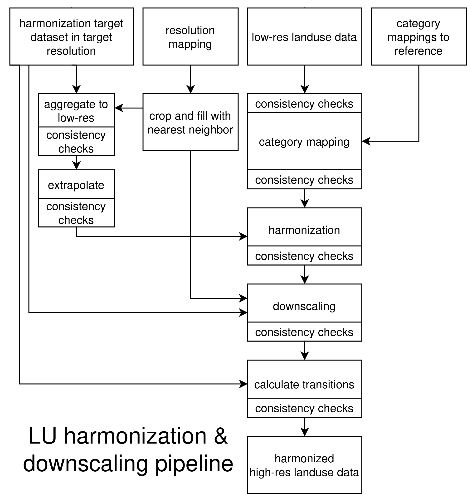

```{r, include = FALSE}
knitr::opts_chunk$set(collapse = TRUE, comment = "#>")
```

The purpose of the mrdownscale package is to harmonize and downscale input spatio-temporal land use data, usually projections created by a model such as MAgPIE, to a high-resolution historical reference dataset, e.g. the LUH2 dataset. First, harmonization is done on low resolution by smoothly over time transitioning from historical reference data to the input data. Then the harmonized low-resolution data is disaggregated using the high-resolution reference data as weight. The output is a high-resolution dataset that is consistent with the historical reference data while over time converging to the input data.


mrdownscale is built upon the madrat framework, a data processing framework that fosters clear structure, dividing data processing into distinct steps, while also providing features such as caching and tools for common tasks such as aggregating and disaggregating. More information on madrat can be found [here](https://pik-piam.r-universe.dev/articles/madrat/madrat.html).




Figure 1: The top row shows the inputs to the pipeline. The resolution mapping should map from low / input data resolution to a grid. Two category mappings should be provided, one mapping the input categories to reference categories (e.g. inst/extdata/magpie2ref.csv) and one mapping the target categories to reference categories (e.g. inst/extdata/luhmod2ref.csv).
The given resolution mapping is adapted to map from low resolution to the high resolution of the target dataset using a nearest neighbor approach and cropping leftover cells. After each step of the pipeline consistency checks are run to ensure that invariants and constraints are true.


To harmonize and downscale MAgPIE data using LUH2v2h as target dataset run the following:
```{r, echo = TRUE, eval = FALSE}
library(mrdownscale)
madrat::setConfig(mainfolder = "./madrat_mainfolder")
madrat::retrieveData("ESM", puc = FALSE)
```
This will run mrdownscale:::fullESM to generate a harmonized and downscaled dataset in a format compatible with ESM requirements. The output will be written to ~/madrat_mainfolder/output in the form of a tgz archive filled with NetCDF files. This was used to provide land use data to ESMs in RESCUE / OptimESM.
